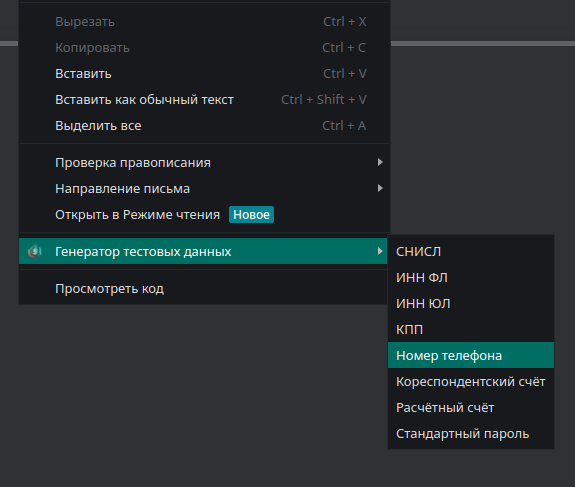

# Браузерное расширение для генерации тестовых данных (Chrome, Yandex)

Браузерное расширение, позволяющее в один клик сгенерировать и  вставить в поле данные.

В настоящее время реализованы следующие генераторы:
- СНИЛС
- ИНН ФЛ
- ИНН ЮЛ
- КПП
- Корреспондентский счёт 
- Расчётный счёт
- Номер телефона
- Вставка пароля, сохраненного в настройках

**Технологии**: JS, HTML

**Тестировалось**: Chrome, Yandex Браузер

## Установка

- [Chrome](https://developer.chrome.com/docs/extensions/get-started/tutorial/hello-world#load-unpacked)
- [Yandex](https://yandex.ru/support/browser-mobile-android-phone/personal-settings/extensions.html) (Пункт Тестирование)

## Использование

1. Кликнуть правой кнопкой мыши на поле ввода
2. Выбрать пункт контекстного меню "Генератор тестовых данных"
3. Выбрать необходимый пункт меню

#### Или

1. Кликнуть правой кнопкой мыши на поле ввода
2. Использовать Shortcut Shift+Ctrl+*Номер действия*

##### Действия
1. Снилс
2. ИНН ФЛ
3. ИНН ЮЛ
4. Сохраненный пароль

## Планы

1. Подключение библиотек для генерации фейковых персональных данных (ФИО и т.д)
2. Включение/Выключение генераторов
3. Разработка UI для popup
4. Кроссбраузерность
5. Настройка Shortcut
----

[LICENSE](LICENSE)
