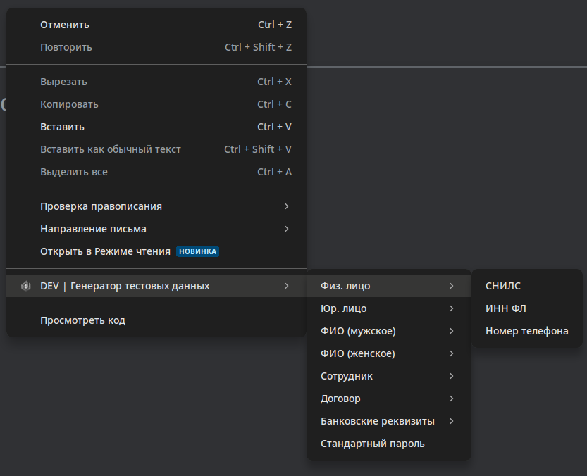

# Браузерное расширение для генерации тестовых данных (Chrome, Yandex)

Браузерное расширение, позволяющее в один клик сгенерировать и вставить в поле данные.

В настоящее время реализованы следующие генераторы:

- Персональные данные ФЛ:
    - СНИЛС
    - ИНН ФЛ
    - Номер телефона
    - ФИО (по частям/вместе, мужское/женское)
- Данные ЮЛ
    - ИНН ЮЛ
    - КПП
- Данные работника:
    - Должность
- Банковские реквизиты:
    - Корреспондентский счёт
    - Расчётный счёт
- Реквизиты договора:
    - Номер договора
- Прочее:
    - Вставка пароля, сохраненного в настройках

**Технологии**: Plasmo, React, antd, TS

**Тестировалось**: Chrome, Yandex Браузер

**Собиралось**: node v20.11.1, yarn v1.22.21


## Сборка

```
yarn install
yarn build
```

Результат в build/chrome-mv3-prod

## Установка

1. Скачайте упакованное расширение в разделе релизов
2. Следуйте инструкции для вашего браузера:

- [Chrome](https://developer.chrome.com/docs/extensions/get-started/tutorial/hello-world#load-unpacked)
- [Yandex](https://yandex.ru/support/browser-mobile-android-phone/personal-settings/extensions.html) (Пункт
  Тестирование)

## Использование

### Базовое использование

1. Кликнуть правой кнопкой мыши на поле ввода
2. Выбрать пункт контекстного меню "Генератор тестовых данных"
3. Выбрать необходимый пункт меню



### Включение и выключение генераторов

1. Кликнуть по инконке расширения в списке расширений
2. Выбрать пункт меню "Генераторы"
3. Изменить положение выключателя возле соответствующего генератора
4. Выключенные генераторы будут скрыты из контекстного меню


### Горячие клавиши

1. Настроить горячие клавиши для расширения согласно инструкции от производителя браузера (По умолчанию Ctrl+Shift+1-4)
2. Кликнуть по инконке расширения в списке расширений
3. Выбрать пункт меню "Горячие клавиши"
4. Выбрать генераторы на каждую из комбинаций
5. При необходимости использовать горячие клавиши


## Планы

1. Кроссбраузерность
2. Конфигурация вложенности и положения генераторов
3. Кастомные генераторы
4. Импорт/экспорт настроек

----

[LICENSE](LICENSE)
